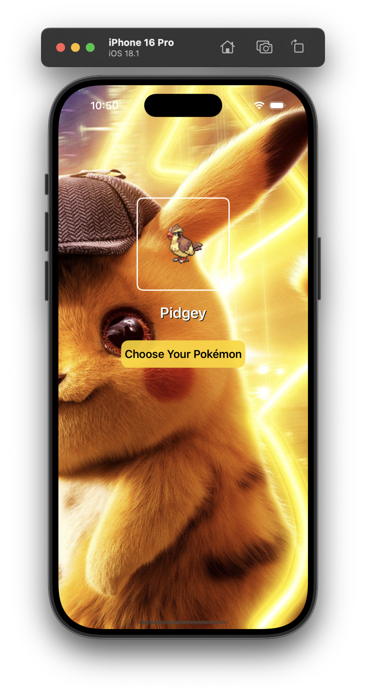

# 🧡 My Favourite Pokémon

A simple and fun iOS app where you can pick your favourite Pokémon using data from the PokéAPI!

---

## ✨ Features

- Fetches a list of 30 Pokémon from the [PokéAPI](https://pokeapi.co/)
- Displays Pokémon names and images in a clean table view
- Lets users select their favourite Pokémon
- Stores selection using `UserDefaults` so it stays even after restarting the app
- Uses async network requests and JSON decoding with Swift’s `Codable` protocol

---

## 🛠 Built With

- **Swift**
- **UIKit**
- **URLSession** for networking
- **UserDefaults** for local storage
- **PokéAPI** as the data source

---

## 📸 App Preview



---

## 📦 Installation

1. Clone the repo:
   ```bash
   git clone https://github.com/your-username/my-favourite-pokemon.git

🧠 What I Learned


->How to use UITableView with custom cells

->Making async API calls with URLSession

->Decoding JSON using Codable

->Passing data between view controllers using delegates

->Storing simple data in UserDefaults


🚀 Future Ideas


*Add more Pokémon and implement pagination

*Show Pokémon types, stats, and abilities

*Use UICollectionView for a card-style layout

*Add a search bar to filter Pokémon


📚 Credits
PokéAPI for the Pokémon data


Built with ❤️ by Simarjeet Kaur
